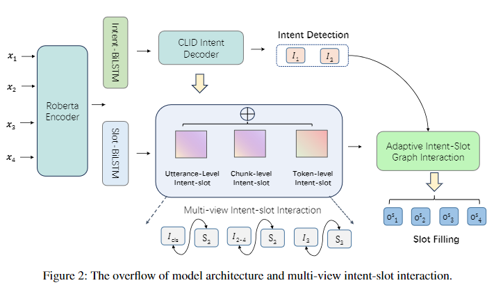

# Uni-MIS: United Multiple Intent Spoken Language Understanding via Multi-View Intent-Slot Interaction


Official code repository for the paper [Uni-MIS: United Multiple Intent Spoken Language Understanding via Multi-View Intent-Slot Interaction](https://ojs.aaai.org/index.php/AAAI/article/view/29910) accepted at AAAI24.



## Setup

In a conda env with pytorch / cuda available, run:
```bash
pip install -r requirements.txt
```


## Train
Example script:
```
python train.py -g -hv -wt tf --decoder agif  --embed_type roberta 
```

## Optimization Recommendations
We recommend performing hyperparameter optimization by using commands :
```
python wandb_atis.py 
python wandb_snips.py
```
These scripts are designed to search for the optimal parameters to enhance the model's performance.


##If you use our data or code, please cite our paper:

```bibtex

@inproceedings{yin2024uni,
    title={Uni-MIS: United Multiple Intent Spoken Language Understanding via Multi-View Intent-Slot Interaction},
    author={Yin, Shangjian and Huang, Peijie and Xu, Yuhong},
    booktitle={Proceedings of the AAAI Conference on Artificial Intelligence},
    volume={38},
    number={17},
    pages={19395--19403},
    year={2024}
    }

```